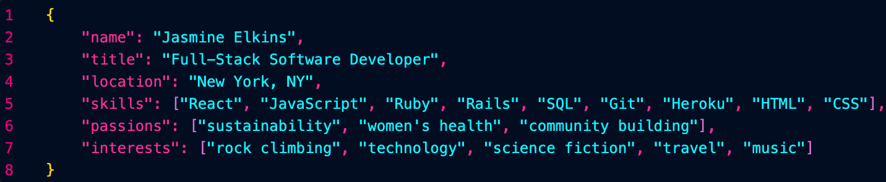

# Hi! I'm Jasmine

Full-stack developer experiences in React, JavaScript, and Ruby on Rails. Proven team collaborator possessing strong communication and organizational skills developed from years of managing multiple simultaneous scientific experiments. A background in chemistry and art have inspired my passion for bringing to life both the technical and visual aspects of my projects. 

Recent graduate from the Flatiron School Software Engineering bootcamp. Excellent at learning new languages and skills in a fast-paced environment and building web applications from initial concept and design to fully developed products. 

Currently based in New York City and looking for a front-end or full-stack position.

## Projects

##### **Forget Me Not** [Repo](https://github.com/jasmineelkins/forget-me-not) || [Demo](https://vimeo.com/723854744/ea6d716679) || [Try it](https://jasmineelkins-forget-me-not.herokuapp.com/)
:newspaper: _Save articles to your custom reading list and receive them as an email newsletter at the end of each week._

##### **Second Guessed** [Repo](https://github.com/ArkfulDodger/secondguessed-fe) || [Demo](https://vimeo.com/723867931/0e273bea58) || [Play!](https://dashing-paletas-01a643.netlify.app)
:sunrise_over_mountains: _Multiplayer game where players describe randomly generated images and vote for the second-best description._

##### **Qardle!** [Repo](https://github.com/jasmineelkins/cardle) || [Demo](https://vimeo.com/manage/videos/723429100/fb39e797cb) || [Play!](https://jasmineelkins.github.io/cardle/)
:black_joker: _Like Wordle- but with cards! Guess the hidden cards of the Qardle within 5 turns._

## Skills

## Get in Touch

 

## Stats

